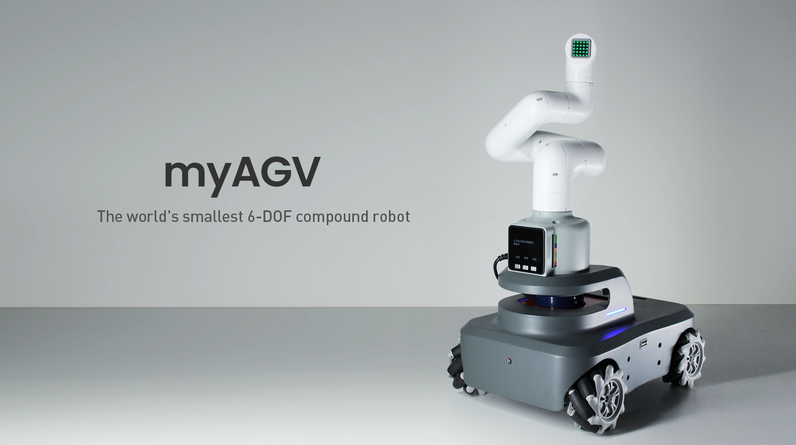

# myAGV

### Product introduction

The world's smallest 6-DOF compound robot, developed jointly by elephant robot and Hua Wei, is fully self-produced. The manipulator uses mycobot and loads camera eye_ in_ Hand design.AGV adopts mcnamu wheel + lidar + high-precision camera. Control mode: autonomous navigation, handle control, keyboard control, etc.

### 2 Product index

| Index        | Parameter              |
| ------------ | ----------------- |
| Model         | myAGV             |
| Size        | 300x205x145mm        |
| Weight      | 3.02kg              |
| Wheel     | mcnamu wheel            |
| Motor  | hall encoder motor         |
| Max.speed speed of motor     | 220RPM/min              |
| Moving speed    | 0.9m/s          |
| Lidar    | 360 ° omnidirectional radar           |
| Identification range         | 8m           |
| Built in controlle      | raspberry pie 4B           |
| Built in camera      | 5M Pixels        |
| Charging voltage     | 24V，1A        |

### 3 Pin description

### 4 Functional features
* 1.Omnidirectional wheel trolley: four McNally wheels, full package design;

* 2.Slam lidar navigation and mapping: real time movement and drawing construction; Autonomous navigation;

* 3.Built in camera: it can identify and accurately locate objects;

* 4.Minimum composite robot: up to 2 mycobot robots can be carried and peripheral actuators can be equipped;

* 5.hand eye calibration: mycobot can accurately locate and calibrate the camera and grab it in a large range;

* 6.Rich teaching system: support ROS simulation and moveit all open source; Meanwhile, the interface is rich: Raspberry pie, Arduino, python, c++;

* 7.Multiple ways of play: it can be coordinated by multiple machines, controlled in multiple ways, and multiple robots can move in real time.

### 5 Application

* Laser radar and slam navigation diagram.

* eye-in-hand identification and grab, using different end effector.

* Automatic driving
