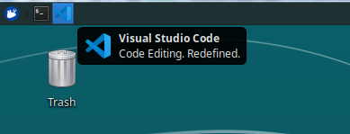
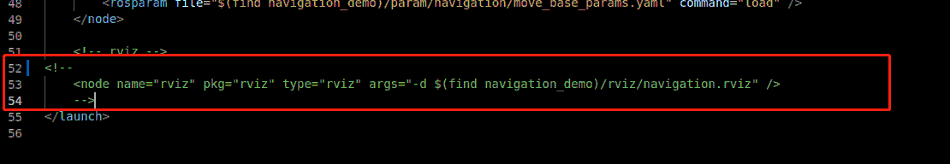
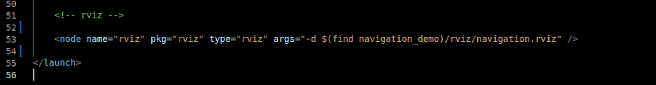
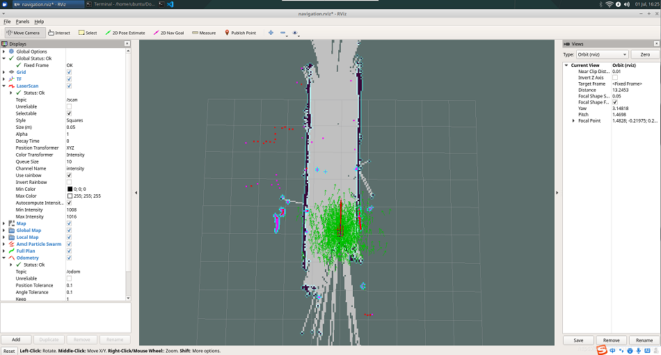
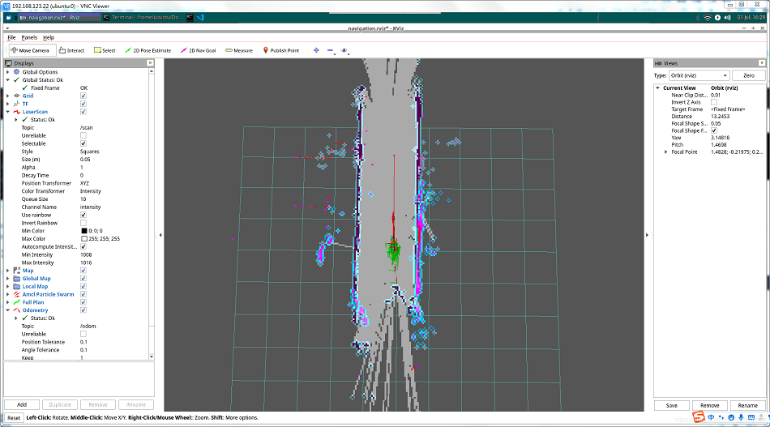
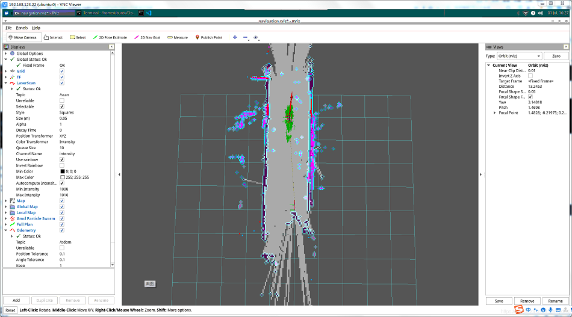

# myAGV map navigation

Previously we had built a space map and obtained two map files, map.pgm and map.yaml under the home directory.


 Now let's look at how to use the established map to navigate for myAGV.

## 1.Copy the map file to the location of the project folder

1. Click the File system icon on the desktop to open the file manager and click "ubuntu" to enter / home/ubuntu directory on the right.
2. You can see that the map we built before is saved under this path, and select these two files.
3. Right-click and click Copy to copy both files.


4. Click on the File system icon on the desktop to open another file manager to enter the following path and paste the map file you just copied under that path:
 > /home/ubuntu/Documents/aibot_ws/src/aibot/navigation_demo/maps/
 


## 2.Modify the launch file
1. Double-click Open Visual Studio Code in the top left corner.



2. open /home/ubuntu/Documents/aibot_ws/src/aibot/navigation_demo/launch/the myAGV_navigation.launch file under the path.

3. replaces the map_office_arm_demo.yaml on line 6 with the filenname map.yaml of our own drawings.


1. Cancel the comment on the penultimate line, select lines 52-54 with the mouse, and press the shortcut keys <kbd>Shift</kbd>+<kbd>/</kbd> to cancel the comment or comment the code segment. This step enables us to open the rviz simulator for map fixed-point navigation when running.


5. Save the modified file and exit (vscode takes up more memory when running. It is recommended to close vscode after modifying the code, otherwise running myAGV system will be very stuck, and vim and other lightweight editors can also be used)
## 3.Run the launch file
1. Open a console terminal (shortcut key <kbd>Ctrl</kbd>+<kbd>Alt</kbd>+<kbd>T</kbd>) and enter the following instructions:
```bash
roslaunch navigation_demo myAGV_navigetion.launch
```
2. can see a Rviz simulation window opened in which the map we built and the relative position of the myAGV in the map.
**Note: the initial position of the myAGV needs to be placed in the departure position of the myAGV when we built the map, so that the map and navigation function are used normally.**

3. clicks on the top toolbar for the "2D Nav Goal".

4. Click on the point we want to reach on the map, and the myAGV will start toward the target point, and you can also see a planned path of the myAGV between the starting point to the target point.

5. The trolley reaches the target point, movement of space can also be seen in the Rviz interface and "Goal reached" is displayed in the terminal.


