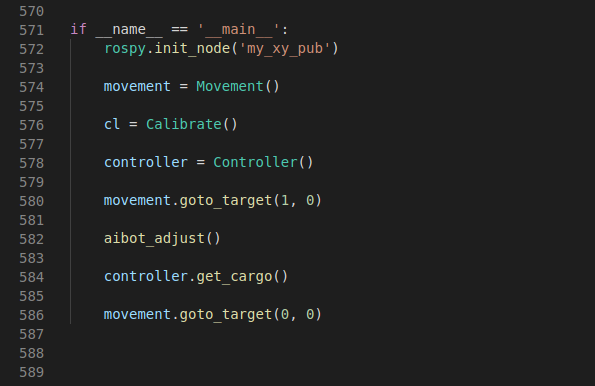

# myAGV and mycobot linkage
## Control principle 
With the Raspberry PI in the myAGV and the Linux operating system, the Mycobot series of robotic arms can be controlled.
>In this Demo, the program drives myAGV to a specific location and then stops in front of the platform where the target object is placed.  It then controls the robotic arm to identify the object, grab it and put it on the myAGV's car.  Finally, we bring the object back to our starting position to complete a remote point fetching and returning to the starting point.  
### myAGV
The car's lidar was used to build the scene map in advance, and the camera and Aruco markers were used to accurately locate the scene  
### mycobot robot arm
The control of the manipulator can be referenced[https://www.elephantrobotics.com/docs/myCobot-en/](https://www.elephantrobotics.com/docs/myCobot-en/)
The robot arm visual recognition is also achieved by pasting the Aruco mark on the surface of the target object. According to the posture information obtained by the Aruco mark, the robot arm and the end suction pump are controlled to reach the corresponding point position.  
*For more information about Aruco, see the Location section*

## Code implementation
The main logical flow implemented in the code is as follows

### possess 
1. rospy.init_node('my_xy_pub')
First create a node，my node here is call 'my_xy_pub' this node is used to send data to ROS servicer.

2. movement = Movement()
   Materialize a "Movement" class that controls the movement of the car

3. cl = Calibrate()
   Materialize a "Calibrate" class to control the precise positioning of the car when moving 

4. controller = Controller()
   Materialize a "Controller" class that controls the actions of the manipulator

5. movement.goto_target(1, 0)
   Call the "goto_target" function under the movement class to get the car to the point (1, 0) in the map coordinates  

6. aibot_adjust()
   After reaching the coordinate position (1, 0), the precise positioning of the car is opened, so that the car can accurately reach the front of the platform where the target object is placed  

7. controller.get_cargo()
   The robot arm is controlled to visually identify and grab the target object with the Aruco mark, and the object is placed on the back platform of myAGV  

8. movement.goto_target(0, 0)
   Bring the target object back to position (0, 0)，which is also the point where we start.

## Run the launch File and python file

1. Open a console terminal (shortcut key <kbd>Ctrl</kbd>+<kbd>Alt</kbd>+<kbd>T</kbd>) and enter the following instructions:
```bash
roslaunch navigation_demo myagv_navigetion.launch
```
2. Open another terminal，and enter the following instructions：
```bash
roslaunch mycobot_ros mycobot_detect_marker_with_topic.launch
```
3. Open another terminal，enter to the folder which contain reach_pump.py file,
    and enter the following instructions：
```bash
python2 reach_pump.py
```
*in my situation, reach_pump.py is exist in the following path:/home/ubuntu/Documents/aibot_ws/src/Thirtyparty/mycobot_ros/scripts*