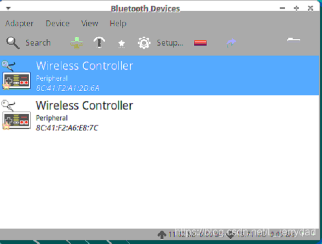

# myAGV PS4 controller

## 1.Connect the handle

### 1.Establish a data connection channel for the serial port and Bluetooth protocol layer
Open a console terminal (shortcut <kbd>Ctrl</kbd>+<kbd>Alt</kbd>+<kbd>T</kbd>) and enter the following instructions at the terminal:
```bash
sudo hciattach /dev/ttyAMA0 bcm43xx 921600 noflow -
```
Mark of Success: 

> Device setup complete

If timeout runs again until Device setup complete appears.
### 2.Register for Bluetooth control
Enter the following command in the terminal to register Bluetooth control and enter the Bluetooth control command line:

```bash
sudo bluetoothctl
```
### 3.power on
Enter the following command at the terminal:

```bash
power on
```
Mark of Success:

> Agent registered

### 4.discoverable on
Enter the following command at the terminal:

```bash
discoverable on
```
Mark of Success:

> Changing discoverable on succeeded
### 5.scan on
Enter the following command at the terminal:

```c
scan on
```
Mark of Success:

> Discovery started
### 6.The pairing is made
1.First press **ps** and **share** for five seconds and pair when the indicator flashes quickly

2.Finds the Bluetooth logo in the top right corner of the interface and clicks on the Bluetooth-> Devices, to see the address of the remote handle, like my one here is 8C:41:F2:A1:2D:6A


3.pairs our handle device and enters in the terminal (the ADDR here is the address we just read now, and the device address you read when actually connected):

```bash
pair  8C:41:F2:A1:2D:6A  //The ADDR here is the address we read just now and enter the device address you read when actually connected.
```

4.Connects our handle device, enter in the terminal (ADDR here is the address we just read, enter the device address you read when actually connected):

```bash
connect 8C:41:F2:A1:2D:6A  //The ADDR here is the address we read just now, and enter the device address you read when actually connected.
```
5.You can see that the device connection is successful and the handle indicator is always blue
Mark of Success:

> Connected：yes


## 2.Open the launch file of myAGV
Open a new console terminal and enter on the command line:

```bash
roslaunch navigation_demo myAGV_navigation.launch
```
Mark of Success:

> First imu received.


## 3.Open the handle control launch file

Open a new console terminal and enter on the command line:

```bash
roslaunch ds4_driver ds4_twist.launch
```
Mark of Success：Connected to Bluetooth Controller +[ADDR] 


If you successfully get here, you can successfully use the handle to control the walking of myAGV. Because the handle has no speed regulation function, the speed will be faster, so you should drive carefully.
