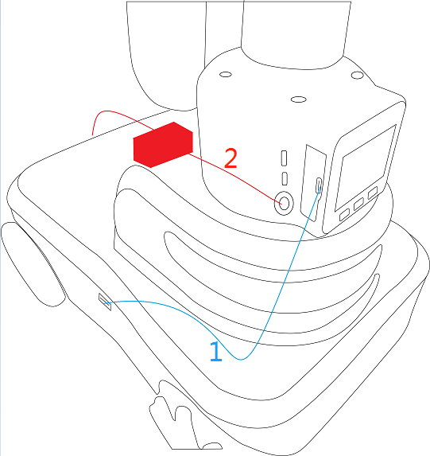

# Install mycobot on myAGV

> In myAGV, we've got the Mycobot arm interworking with all kinds of end-effectors that allow you to do all kinds of fancy things, and here's how to connect  
## 1.Mycobot installs on myAGV  
The connection is shown in the following figure：

1.Type C wire 2.Power for mycobot 

## 2.Mycobot控制
myAGV comes with a Raspberry PI 4B development board, which has a LINUX operating system built in, and controls for individual robotic arms can be found at the website  ：

[https://www.elephantrobotics.com/docs/myCobot-en/](https://www.elephantrobotics.com/docs/myCobot-en/)