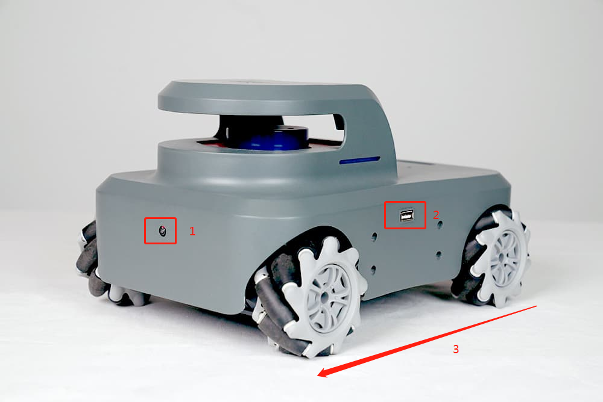
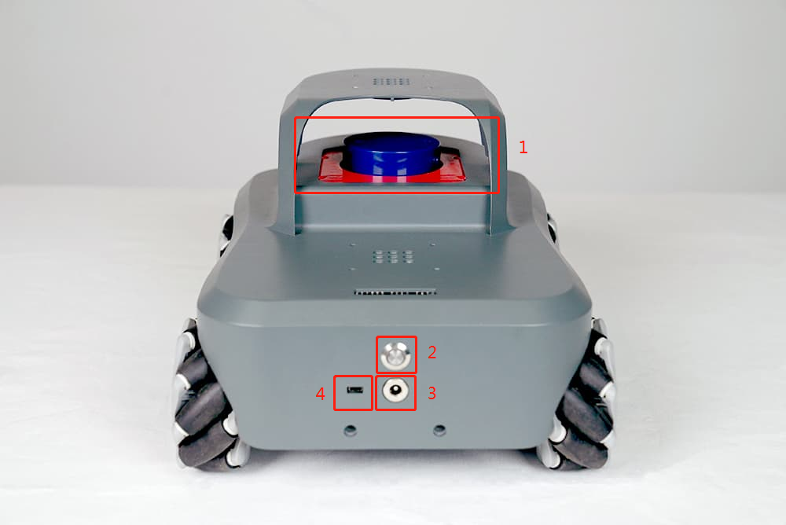
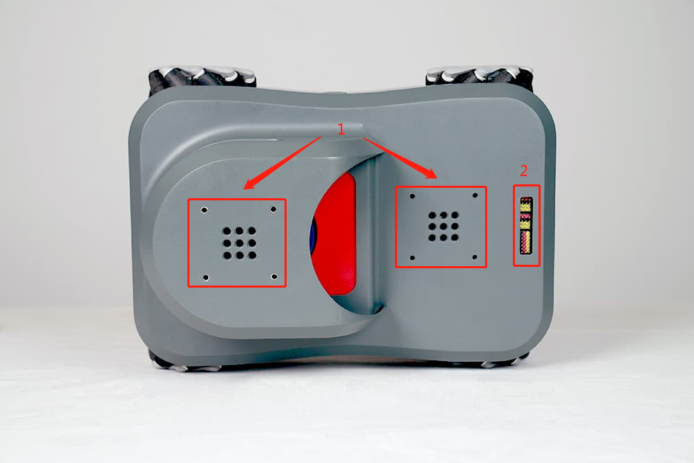
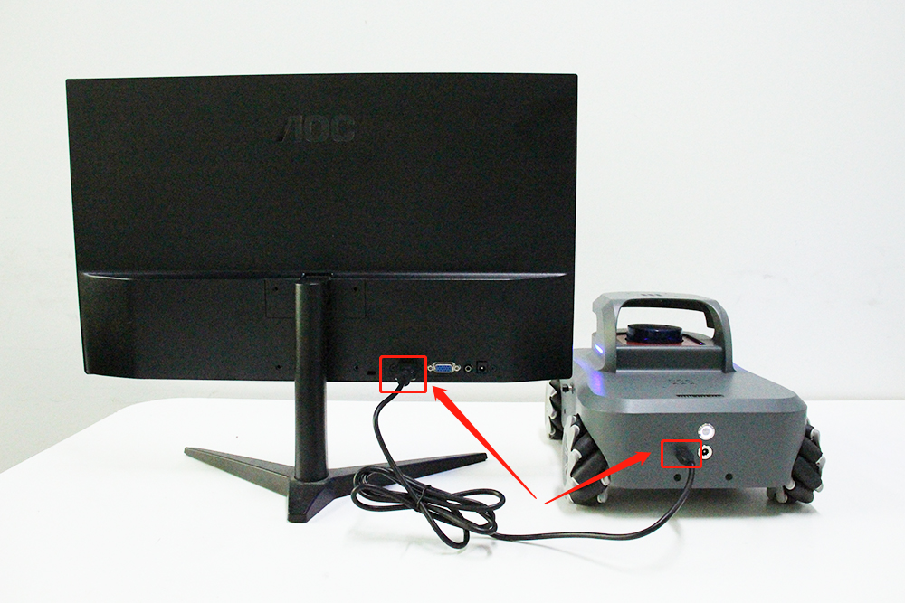
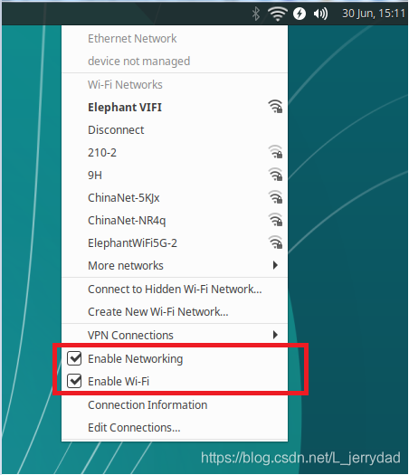
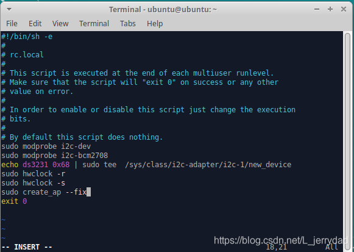
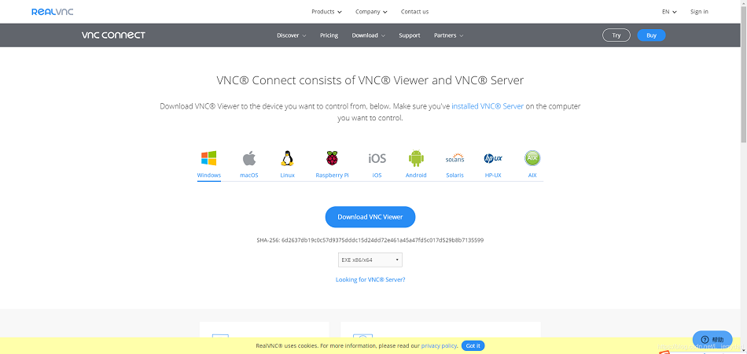
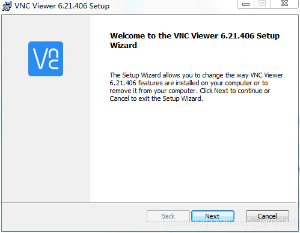
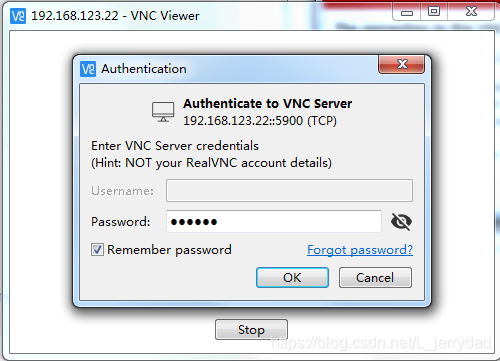
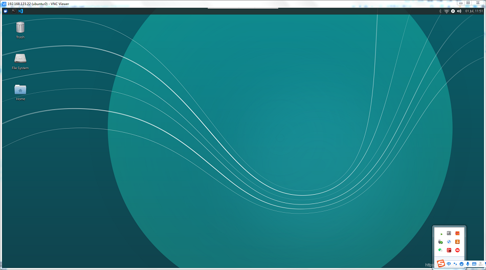

# myAGV trolley for first use
First of all, congratulations on getting an interesting myAGV.
Using this advanced myAGV, you can give full play to your brain hole to create and realize various unrestrained functions.
Then, let's start.


## 1.myAGV brief introduction

* myAGV adopts the McNham wheel + Radar + high-precision camera scheme.

* What is mcnamu wheel: the design principle of mcnamu wheel is that rollers arranged at a 45 degree angle with the axis are installed in the outer ring of the wheel to contact the ground. When rotating, the friction will produce a 45 degree reverse thrust with the axle. This oblique thrust can be divided into longitudinal and transverse vectors. The whole myAGV body is driven by two pairs of mcnamum wheels with mirror arrangement of rollers. Each wheel will produce corresponding vectors. The resultant force of these vectors determines the final active state of the myAGV body. By adjusting the steering and rotational speed of each wheel alone, the movement modes of the whole vehicle body, such as forward, transverse, oblique, rotation and combination, can be realized.


1.high-precision camera 2.USB interface 3.myAGV forward direction

1.Lidar 2. power switch 3. Charging port 4.HDMI interface

1.Lego interface 2. Expand pin pins


## 2.Power-on 
* 1.Connect the HDMI interface to the display
Before starting the myAGV, be sure to connect the screen and connect the HDMI interface of the myAGV and the HDMI interface of the screen through the HDMI transmission line. This is because the trolley system is required to connect a solid screen to start the operating system.



* 2.Connect the keyboard and mouse
myAGV has a built-in raspberry pie development board, and there is a USB interface on the left and right sides of the car, as shown in the figure below, connecting the keyboard and mouse.


* 3.Press the power-on button
Press the start button to start myAGV, wait for about one minute, and then enter the login interface. The general initial password is:aibot1234
After entering the system, the desktop should be the following:


## 3.Internet

After the first boot, we can connect myAGV to WiFi, which is convenient for us to download software and update code.
First click on this icon in the top right corner:


Check Enable Networking and Enable Wi-Fi, to ensure that there are two pair √ s before both options
After clicking on, check Enable Networking and Enable Wi-Fi to ensure that there are two checkmarks in front of these two options √


At this time, you can see the wifi information that we can connect nearby, and select your wifi input password to successfully connect.

If nearby wifi information is checked, you can open a terminal console (shortcut <kbd>Ctrl</kbd>+<kbd>Alt</kbd>+<kbd>T</kbd>) and enter the following instructions:

```c
sudo create_ap --fix
```
This instruction needs to be executed once after each boot. If you do not want to be too troublesome, save this command in the configuration file as follows:
1. Enter the following instructions at the terminal to open the profile:
```c
sudo vim /etc/rc.local 
```
2. The editor interface appears and use the keyboard direction key to move the cursor to the following position:

3. Press the keyboard <kbd>o</kbd>to enter the edit and add our instruction: sudo create_ap--fix to the file:

4. Then press <kbd>Esc</kbd> to exit edit mode, press<kbd>Shift</kbd>+<kbd>:</kbd>, and then enter wq to save the file and exit editing.

## 4.Remote connection to myAGV desktop using VNC
See here you may have questions, myAGV is free to walk around, if always connected to a screen, how to gallop.
Here we can use VNC to solve this problem with the remote desktop.

VNC (Virtual Network Console) is an abbreviation for the Virtual Network Console. It is an excellent remote control tool software, VNC is free open source software based on UNIX and Linux operating systems, powerful remote control, efficient and practical. VNC basically consists of two parts: part is client's application (vncviewer); the other is server-side application (vncserver).


**1.Install vncserver in myAGV's system**
1. First open a console terminal (shortcut <kbd>Ctrl</kbd>+<kbd>Alt</kbd>+<kbd>T</kbd>), enter the following instructions to update the software source library:

```c
sudo apt-get update 
```
2. Install VNCserver, Enter the following command at the terminal:

```c
sudo apt-get install vnc4server
```
3. Start vnc4server, Enter the following command at the terminal:

```c
vnc4server
```

You are prompted for a password, which will be used when linked through the client.

When you enter the password, you will see a prompt similar to the following side:
> New ‘3 ()’ desktop is ****:3 (****代表主机名） Take notice of the number
> after the colon (, in this case it is “3.”


One will occur in your home directory after starting the vnc4server. Directory of the vnc.

This is now possible to link to the server via the vnc client.

**2.Install the VNCviewer on your computer**

Open the browser and go to the website:
[https://www.realvnc.com/en/connect/download/viewer/](https://www.realvnc.com/en/connect/download/viewer/)

Select the system corresponding to the computer, and download the installation file.



Start the installation, the language can choose English, German, French, Italian and Western, click ok to go to the next step:


Then keep clicking "next", using the default settings.


**3.Remote connection of computer to myAGV desktop**

First enter in the terminal command line of the myAGV: **ifconfig** to check the IP address of the myAGV, where I must address 192.168.123.22.22. The IP address changes dynamically and changes with different WIFI connection, so after each startup, it is recommended to check the IP address to confirm any change.


Open the vncviewer client on the computer side, enter the myagvoip address we just read in the top small window, and then press enter.


Click on the word "continue"


Enter the password of the VNCserver we set on the myAGV, it is recommended to check "Remember password" does not need to enter the password the next time you log in. Then click on "ok"


It's done. Now we can remotely connect myAGV's desktop on the computer and control it.


**The above are some initialization operations used by myAGV for the first time after unpacking. Have a good time！**
