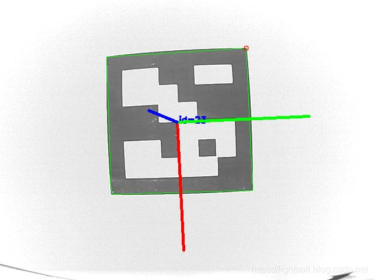
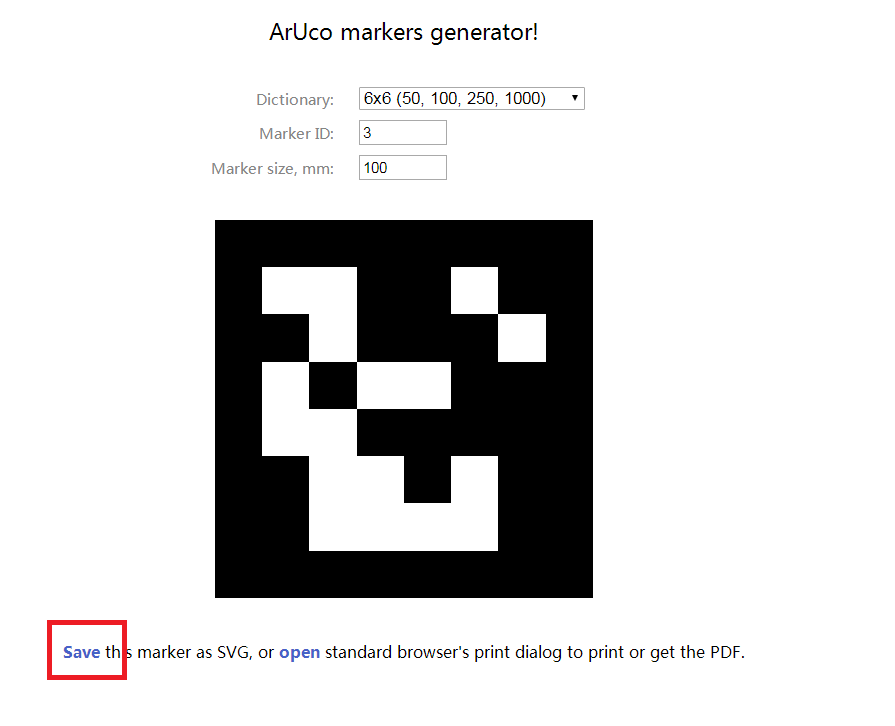

# myAGV Precise Camera Positioning
## 1.Camera Positioning Principle
In the positioning process, we used Aruco identification to assist positioning
> An ArUco marker is a binary square marker, which is composed of a wide black edge and an internal binary matrix, and the internal matrix determines their IDS.  The black boundary facilitates rapid image detection, binary coding can verify THE ID, and allows the application of error detection and correction techniques.  The size of marker determines the size of the internal matrix.  For example, in the figure below, a 4x4 marker consists of 16bits  
> 
>It should be noted that we need to detect the rotation of a Marker in space. However, the detection process needs to determine its initial Angle, so every corner needs to be clear and ambiguous, ensuring that the above mentioned point is also accomplished by binary coding.  When the Marker is rotated in the space, the corresponding binary information will also change. According to the variation, the position and attitude of the Marker relative to the camera in the space can be obtained, as shown in the figure below. The coordinate system and boundary of the Marker can also be displayed in the camera screen:  
> 
Flow chart as below：


## 2. Precise positioning environment preparation
### 1.Generate an Aruco marker
First we need to parper two Aruco marker，it can be generated automatically in this webpage：[https://chev.me/arucogen/](https://chev.me/arucogen/)


In our demo,We chose a dictionary set of 6*6, with the size of 50mm and two marker markers with the ID of 3 and 4 respectively. Then click the red "Save" in the picture to save the generated marker in the local format of PDF, and then the actual marker can be printed out with the printer for later positioning and use.  
### 2.Place the Aruco marker
As mentioned above, the precise positioning of the camera is based on the position analysis of two characteristic Aruco markers to obtain the precise positioning path planning.  As shown in the figure below, paste the Aruco mark printed in the previous step on both sides of the target point we want to reach.  
**Note: The distance between the two mark distances should be consistent as far as possible, so as to ensure the accuracy of distance calculation**

## 3.Software operation
### 1.Open myAGV navigation file
 first open a terminal(shoutcut key<kbd>Ctrl</kbd>+<kbd>Alt</kbd>+<kbd>T</kbd>),enter instruction as below
```c
roslaunch navigation_demo myAGV_navigation.launch
```
### 2.Run the precision locator program
open another terminal，enter code as below：
```c
rosrun navigation_demo aibot_detect_marker.py
```
  *It is suggested that the initial position of the car should be greater than 40cm away from the target so that the camera can simultaneously take pictures of the marks on the left and right sides*