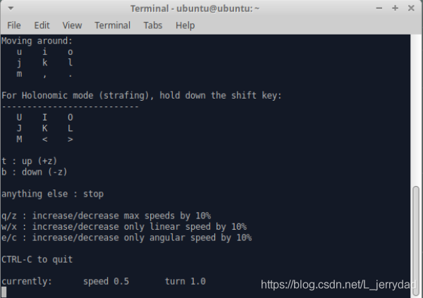
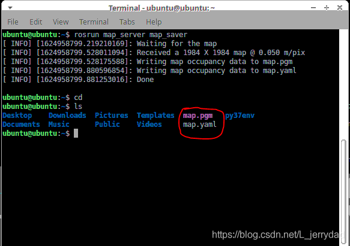

# myAGV mapping
## 1.Open the slam laser scan launch file

After opening the trolley, open the console terminal (shortcut <kbd>Ctrl</kbd>+<kbd>Alt</kbd>+<kbd>T</kbd>) and enter the following instructions on the command line:
```bash
roslaunch navigation_demo myAGV_slam.launch 
```
***Note: before starting the launch file, please place myAGV at a suitable starting point in the environment where mapping is required, because opening the launch file will start myAGV's IMU sensor and Odom odometer, and artificially moving myAGV will cause myAGV mapping distortion.***

Open the launch file required for myAGV slam laser scanning, if displayed.

> First IMU message received.

It indicates that the myAGV drawing file is opened successfully, and the display status in the terminal is as follows:


A Rviz simulation environment also opens, with red myAGV visible in the Rviz and arrows.

***Note If the Rviz simulation cannot open, you can see if the bottom 2-4 rows of the myAGV_slam.launch file are commented and if only uncommented.***

## 2.Open the keyboard control file teleop_twist_keyboard.py

Reopen a console terminal and enter in the terminal command line:

```bash
rosrun teleop_twist_keyboard teleop_twist_keyboard.py 
```

**Direction key：**
Press the    | Direction
-------- | -----
i  | forward
，  | back off
j | Right rotation
l | Left rotation
u|Left forward
o|right forward
m|left back
.|right back 

**Acceleration and deceleration：**

Key |Meaning
------|-----
q/z|linear speed and angular speed plus / minus 10%
w/x|linear speed plus / minus 10%
e/c|acceleration / deceleration of angular velocity 10%

## 3.Start the drawing
Now myAGV can start to move under the control of the keyboard. Control myAGV to turn around in the space required for drawing. At the same time, we can see that in the rviz space, our map will be built little by little with the movement of myAGV（ It is suggested to use the 'Z' key on the keyboard to reduce the travel speed of myAGV, which is helpful to obtain a more accurate map when building a map)
***Note: when operating myAGV with the keyboard, make sure to run teleop_ twist_ The terminal of keyboard.py is the currently selected window, otherwise the keyboard control program cannot recognize the keys of the keyboard.***


## 4.Save the built map
Open a new console terminal and enter the following command in the command line to save the map scanned by myAGV:
```c
rosrun map_server map_saver 
```
After a successful operation, the terminal appears as follows:


You can see here that we drew a red circle, just two files generated after the map was saved, map.pgm and map.yaml. Both files are saved in the home directory by default. Entering **cd** within the same terminal will go to our home directory, and then entering **ls** can see that the map file generated under the home directory has been generated.



